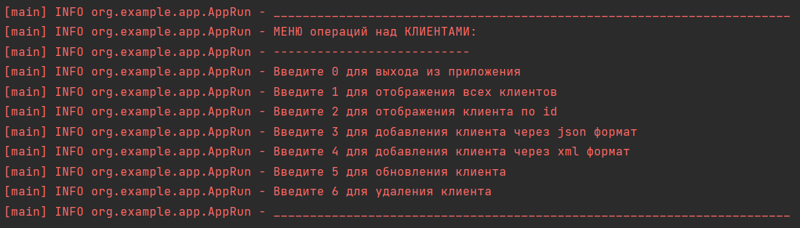

Проект: Консольное приложение для работы с сущностью Клиент.

Запуск приложения:
1. скачать проект;
2. в командной строке перейти в папку, где находится файл docker-compose.yml и выполнить команду docker-compose up -d
3. запустить в классе App метод main().

Автоматически при запуске контейнера с postgres произойдет создание базы данных, а при первом запуске приложения произойдет создание таблицы  clients в базе данных.

Также в консоли выведется главное меню для работы.



Данное приложение работает с консолью, поэтому необходимо выбирать пункт того, что хотим сделать и дальше вводить в консоль, запрашиваемую приложением информацию.

Возможности приложения:
1. Выводить всех клиентов.
2. Вывести Клиента по id.
3. Добавить Клиента передавая его в формате json.
4. Добавить Клиента передавая его в формате xml.
5. Обновить Клиента.
6. Удалить Клиента по id.

Пример Клиента в формате json:
```
{"firstName":"Ivan","lastName":"Ivanov","email":"ivan2000@mail.ru","telephone":"+375291234567","birthday":[1984,9,12],"registrationDate":[2023,1,15,15,35]}
```

Пример Клиента в формате xml:
```
<ClientDto><firstName>Ivan</firstName><lastName>Ivanov</lastName><email>ivan2000@mail.ru</email><telephone>+375291234567</telephone><birthday>1984-09-12</birthday><registrationDate>2023-01-15T15:35:00</registrationDate></ClientDto>
```

В приложении происходит валидация данных Клиента и если введены некорректные данные будет выброшена ошибка с описанием проблемы.

Валидация данных:
1. проверка имени Клиента на null и empty;
2. проверка фамилии Клиента на null и empty; 
3. проверка имени Клиента на длину от 2 до 10 символов;
4. проверка фамилии Клиента на длину от 2 до 30 символов;
5. проверка на корректность электронной почты;
6. проверка номера телефона на наличии знака "+" в начале номера;
7. проверк номера телефона на наличие 12 цифр.

В приложении для парсинга строки в формате json в объект и обратно использовался jar с проектом самописного парсера.
Для парсинга строки в формате xml в объект использовалась библиотека jackson.

В данном приложении реализован кэш, в который сохраняются Клиенты, при их сохранении в базу данных, получении и обновлении.
Удаление Клиента с базы данных удаляет его из кэша, если он там есть.
При получении Клиента по id в первую очередь идет проверка есть ли такой Клиент в кэше, если есть - то он берется из кэша и не происходит запрос в базу данных. Если такого Клиента нет в кэше - то происходит получение его из базы данных и сохранение в кэше для следующих запросов.

Размер кэша и его тип (LRU, LFU) задаются через application.yml

Также в данном приложении реализовано сохранение кэша в файл (если произведен корректный выход из приложения - через первый пункт МЕНЮ) и при очередном запуске приложения происходит считывание этого файла и восстановление кэша.

В кэше автоматически происходит вытеснение элементов в зависимости от выбранного типа кэша и от его размера.

Работа кэша реализована через АОП с использованием библиотеки aspectj.


